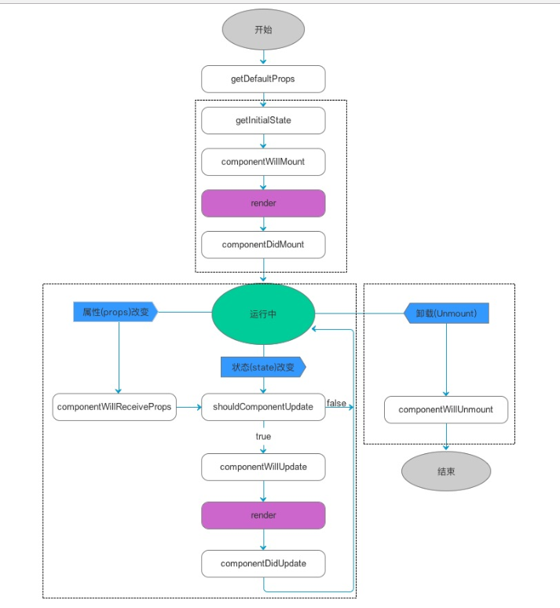

# 前端框架
## React
- 生命周期

- jsx javascipt的语法扩展,一种标记语言，在React编译JSX将它处理为一个javascript对象
    - 可以在JS中书写XML(HTML)
    - 每个解构中只能有且仅有一个顶层元素
    - 可以包含子节点
    - 支持插值表达式
- props和state
    - react的数据流动是自定向下由父级到子级的单向数据流
    - props是组件从父级传入子级的数据，不可被修改
    - state是组件自身内部的状态，可以使用setState修改，主要用来组件控制和修改自己的状态，没有state的叫做无状态组件
- 组件 React的思想主要是关于组件，各个功能可以划分为各个小组件，组件可以灵活复用组合组成更大的组件
    - 创建组件
        - 使用无状态函数
        ```javascript
            function Component() {
                return <h1>Hello World</h1>
            }
        ```
        - ES6类语法 
        ```javascript
            class Component extends React.Component{
                render(){
                    return <h1>Hello World</h1>
                }
            }
        ```
        - ES5类语法 
        ```javascript
            const Component = React.createClass({
            render(){
                return <h1>Hello World</h1>
            }
        })
        ```
- 组件API
    - setState 使用setState修改state值，setState会异步的合并所有的修改然后触发render
    - replaceState 替换状态 
    - findDOMNode获取dom节点
    - isMounted判断组件挂载状态
- 虚拟(virtual)DOM和DOM Diff
## Vue
- 生命周期

## Angular