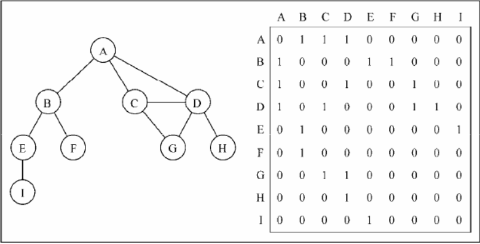
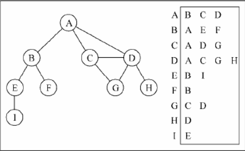
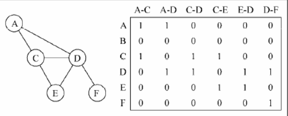

# 图  图是由一组边连接的节点或者顶点
## 概念
- 相邻顶点 - 由一条边连接在一起的顶点
- 顶点的度 - 顶点相邻顶点的数量
- 简单路径 - 简单路径不包括重复的顶点
- 图连通 - 每两个顶点间都存在路径
- 强连通 - 每两个顶点间在双向上都存在路径
## 图的表示
- 邻接矩阵 - 每个节点都和一个整数相关联，该整数将作为数组的索引

稀疏图会浪费很多计算机存储空间，顶点改变二维数组变动麻烦
- 邻接表 - 由图中每个顶点的相邻顶点列表所组成

- 关联矩阵 - 矩阵的行表示顶点，列表示边

- 基于邻接表实现图
```javascript
    class Graph {
        constructor() {
            this.vertices = [];
            this.adjList = new Map();
        }

        addVertex(v) {
            this.vertices.push(v);{1}
            this.adjList.set(v, []);{2}
        }
        addEdge(v, w) {
            this.adjList.get(v).push(w);
            this.adjList.get(w).push(v);
        }

        bfs(v, cb) {
            const queue = [], graphStatus = new GraphStatus();
            queue.push(v);
            while (queue.length > 0) {
                const u = queue.shift();
                graphStatus.detect(u);
                this.adjList.get(u).forEach(item => {
                if (!graphStatus.isDetected(item)) {
                    graphStatus.detect(item);
                    queue.push(item);
                }
                });
                if (cb) {
                cb(u);
                }
            }
        }

        dfs(v, cb) {
            const stack = [],
                colorStatus = new GraphStatus();
            stack.push(v);
            while (stack.length > 0) {
                const u = stack.pop();
                colorStatus.detect(u);
                this.adjList.get(u).forEach(item => {
                if (!colorStatus.isDetected(item)) {
                    colorStatus.detect(item);
                    stack.push(item);
                }
                });
                cb(u);
            }
        }

        findDepth(v) {
            let queue = [],
                colorStatus = new GraphStatus(),
                vPath = { [v]: [v] },
                vDepth = {},
                depth = 0;
            queue.push(v);
            while (queue.length > 0) {
                depth++;
                const u = queue.shift();
                colorStatus.detect(u);
                // 相邻顶点
                const edgeVertex = this.adjList.get(u);
                edgeVertex.forEach(item => {
                if (!colorStatus.isDetected(item)) {
                    // 深度统计
                    vDepth[item] = depth;
                    // 路径统计
                    vPath[item] = [...vPath[u], item];
                    colorStatus.detect(item);
                    queue.push(item);
                }
                });
            }
            return { depth: vDepth, path: vPath };
            }
        }

```


