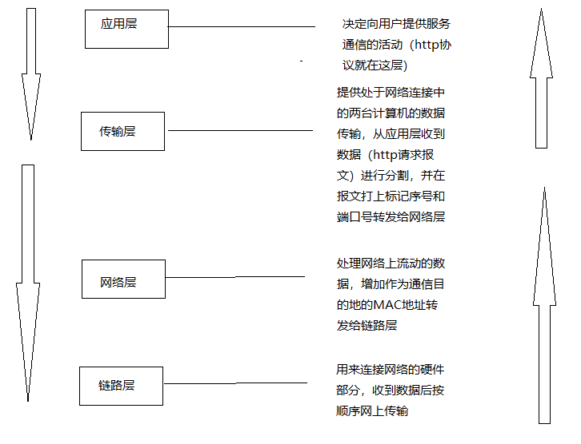
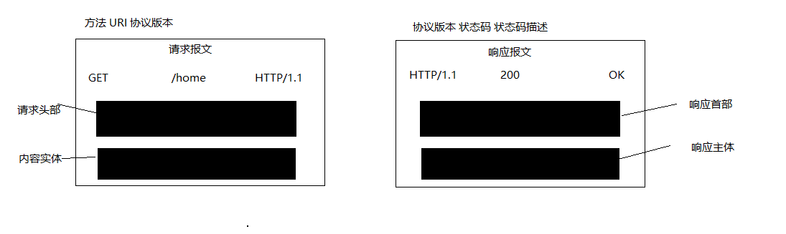
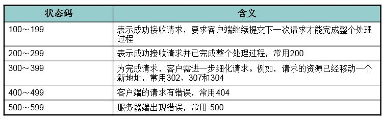

# HTTP
现实生活中双方协议末件事情跟网络通信双方定义的规则都称为协议,互联网相关联的协议集合总称TCP/IP。

## 协议分层 (应用层、传输层、网络层和数据链路层)

## IP协议和ARP协议
- IP协议处于网络层，作用是把各种数据包传送给对方，确保准确无误的传输到对方那里前提是IP地址和MAC地址的正确性。
- IP地址确定节点分配的地址，MAC地址是指网卡的固定地址。
- IP之间的通信依赖MAC地址，中转的过程需要ARP协议通过ip地址解析反查出MAC地址
## 请求报文和响应报文
- 请求报文和响应报文组成

## 常见状态码
借助状态码客户端可以知道服务端是否正确处理了请求

- 204 No Content - 请求已经成功处理，但是响应不包含实体的主体部分，也不允许返回任何实体的主体
- 206 Partial Content - 客户端进行了范围请求
- 301 Moved Permanently - 永久性重定向
- 302 Found - 临时重定向
- 303 See Other - 请求对应的资源存在着另一个URI,应使用GET方法定向获取请求资源
- 304 Not Modified - 服务资源未被修改可直接使用客户端未过期的缓存，返回时不包含主体部分
- 400 Bad Request - 请求报文存在语法错误
- 401 Unauthorized - 发送的请求需要有通过HTTP认证的认证信息，响应必须包WWW-Authenticate首部以质询用户信息
- 403 Forbidden - 访问被拒绝
- 404 Not Found - 服务无法找到请求的资源
- 500 Internal Server Error - 覅服务端在执行请求时发生了错误
- 503 Service Unavailable 服务器暂时超负载货正在停机维护不能处理请求
## HTTP的缺点
- 通信使用明文不加密，内容可能被窃听
- 不验证通信方的身份，因此有可能遭遇伪装
- 无法证明报文的完整性，有可能被篡改
## HTTPS 添加了加密和认证机制的HTTP称为HTTPS
- SSL采用一种叫做公开密钥加密的加密处理方式